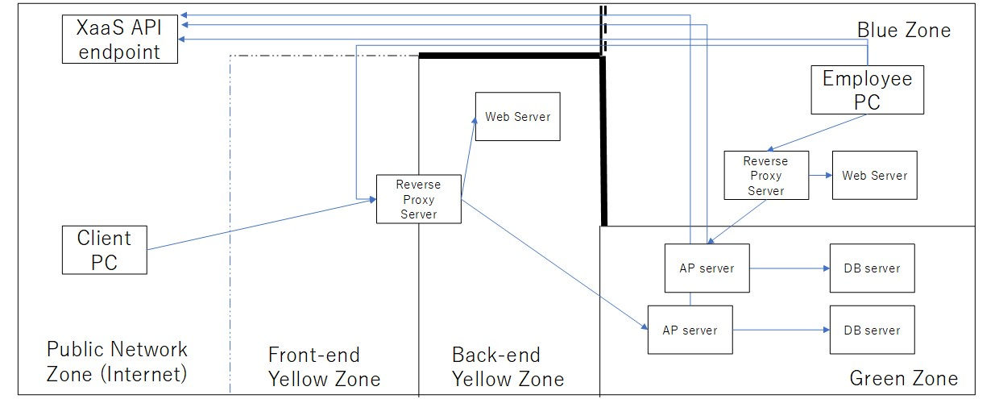

# インフラストラクチャダイアグラムの描き方

こんにちは、KNMB47です！IBMから分社したKyndryl(キンドリル)という会社でシステムの設計や構築・運用を行っています。

このサイトではインフラストラクチャダイアグラムの書き方を提供します。インフラストラクチャダイアグラムは、業務アプリケーションを稼働させるシステム基盤の設計図です。IBM及びKyndrylの標準設計手法の一つである[オペレーショナル・モデリング(Operational Modeling)](https://www.ibm.com/docs/ja/rsas/7.5.0?topic=abstraction-modeling-operational-logical-layout-application)で設計した結果を表現する図です。世間一般にはシステム構成図やインフラ構成図という呼ばれ方もします。

仕様レベル記述で物理的な詳細を排し抽象化しますので次の図のような表現です。

システム基盤の設計について、無駄なくわかりやすく記述できる手法ですので、ぜひ多くの皆様に取得していただければと思い当サイトを立ち上げました。
これからコンテンツを追加していきますので、よろしくお願い致します。(2023.01.15)

# コンテンツ

## 前提

## 基本要素

## 事例

# 当サイト（githubレポジトリ）の利用条件

* 著作権はKNMB47に帰属します。
* サイト上のコンテンツの引用は無断で行っていただき問題ありません
* システムインテグレータや情報システム部門の方々は、サイト上の設計図面などをテンプレートとして無償でご利用いただけます
* インフラストラクチャダイアグラムの読み方や認識合わせのために、当サイトへのリンクをお願いします
* サイト上の情報や解説、コンテンツに誤りが有り損失が発生したとしても責任は負いませんので、ご了承下さい
* コンテンツに対しプルリクエストを頂く場合は、この利用条件で使用されることに了承しているものとみなします
* フォークやコピーをされ再配布する場合は、オリジナルとして当ページのURL(https://knmb47.github.io/designinfra/)へのリファレンスをしてください
