# 基本要素

インフラストラクチャダイアグラムの基本要素を解説します。代表的なものをリストアップすると以下になります。

* ゾーン
  * ゾーン境界
* ロケーション
* ノード
  * テクニカルノード
  * ストレージ
* プロセス
* コネクション
* アクター
  * 外部システム

今後の投稿で具体的な解説しますが、ここでは概要レベルで要素の説明をしていきます。注意事項として、Amazon Web ServiceやAzure等などのクラウドサービスで使われる定義とは少々違います。当然ながら概念として重なる部分もありつつ、実装上の味付けがあります。筆者が理解する範囲で、その辺りの補足もしておきます。

## ゾーン

図の上でゾーンはノードを入れる大きな枠として記述します。ゾーンは非機能要件の分類を意味し、ゾーンの枠は非機能要件の境界を意味します。非機能要件の分かりやすい例えは、トラディショナルなセキュリティ確保水準での分類です。セキュリティという非機能要件では、「制御不能ゾーン」>「制御ゾーン」>「制限ゾーン」>「安全ゾーン」>「保護ゾーン」などでデータ保存時のセキュリティ確保水準を分けるかもしれません。

設計の過程で、これから作るシステムのアーキテクチャを形作るにあたり、設計図の枠に物理的な建物や部屋を書いてから始めるのはお奨めできません。それらは別で説明するロケーションで考慮します。システムが満たそうとする非機能要件を整理し、確保する単位で決定を行っていく必要がありますので、まずはゾーンから始めることになります。

クラウドサービスで出てくる「アベイラビリティゾーン」は、「データセンター」を超えて「可用性（アベイラビリティ）」の担保を目標とする機能を備えたゾーンということです。AWSのページを見ていると、昨今のコンピューティングの利用ニーズに合わせて、「Wavelength」「ローカルゾーン」というデバイスとの通信レイテンシに着目したゾーン定義も増えているようですね。

非機能要件として、セキュリティと可用性のゾーンを紹介しました。同じシステムを別の非機能の尺度でみる場合、ゾーンの区分けも異なり、見た目が違う（ビューが違う）結果になります。

### ゾーン境界

ゾーン同士が接し合うところを検討します。非機能要件の違うゾーンが接するため壁が必要になります。

非機能要件の違いを感覚的に説明するために、ゾーンが水槽だと思い、非機能要件を水の温度だと思って下さい。設計者としてはゾーン内部の非機能要件＝温度は一定に保ちたいものです。温水ゾーンと冷水ゾーンの間に境界があり、そこが有機素材の半透膜でつながっていたら、熱エネルギーの交換が簡単に行われて、温水も冷水もぬるくなってしまいます。それぞれのゾーンに設定した温度の維持は難しくなります。この例では、断熱壁を設計することになります。

全く連動がないゾーンの間は断絶するような仕掛けで良いのですが、互いのゾーンにそれぞれ属するノードが通信をする際には、ゾーン境界をどのように設計するか検討することになります。

## ロケーション

ロケーションは「具体的な場所」を意味します。データセンターの何階のROOM1等の名前がつけられる具体的な場所です。物理的なセキュリティ保護や地政学上のリスク等、すべての非機能の組み合わせがセットになったシステム設計上の制約です。

クラウドサービスでいう「リージョン名」や「アベイラビリティゾーン番号」は、かなりざっくりな「ロケーション」の例です。ここで、ゾーンとロケーションがごっちゃになってきたと思うかもしれません。「ゾーン」の定義は物理的な概念である「ロケーション」から切り離されていたいところです。クラウドサービスでは、リージョン（特定地域）の中にアベイラビリティゾーンを実現してます。一般的に我々がクラウドサービスを使用するときに使っているアベイラビリティゾーンの認識は、アベイラビリティーゾーン定義が特定のリージョン内に実装された実体になります。ゾーンと呼ばれていても物理実体があり、リファレンス番号や名前がついているものはロケーションです。

## ノード

コンピューティングの計算ロジックの実行を管理する単位です。ノイマン型コンピュータ・アーキテクチャを構成する論理的な単位です。
つまり、中央演算装置、主記憶装置、補助記憶装置を持ち、周辺と入出力する装置がついています。今回、アーキテクチャ記述で述べるのは、2000年以降はデファクト・スタンダードとなったTCP/IP v4/v6を前提にしたネットワーク通信が可能なコンピュータ・デバイスをノードとします。また、同時に現代では当然ながらOS(Operating System、オペレーティング・システム)が動作しているものを言います。

### テクニカルノード

ノードは、適用業務システム（アプリケーション・システム）を構成する応用プログラムを動かすものもあれば、ネットワーク通信や負荷分散装置など、専門的機能を担うノードがあります。インフラストラクチャダイアグラムは、専らアプリケーション・システムの設計のために分析・記述を行うものです。その為、応用プログラムを動かさない固定的な専門的機能を担うノードを区別して、テクニカルノードと呼びます。詳細のページで取り扱う話題ですが、一部のテクニカルノードは抽象化レベルを上げたインフラストラクチャダイアグラムでは省略した記載になり図に現れません。具体的には、「ファイアーウォール」と呼ばれるネットワーク装置は、前出の「ノード境界」を実現するテクニカルノードであり、他のノードのような図としての表現は省略されます。（図に居場所があるだけ良い方で、ルータに至っては、仕様レベルの論理図では記述してはいけません。特別な機能を持つ場合のノードとして登場することもありますが。）

### ストレージ

テクニカルノードの一つの例は、ストレージ装置です。Network Access Storageや、ストレージ装置のコントローラも、専門的機能としてストレージを扱います。それらも、実際にはCPUを持ち、主記憶装置であるメモリーを持ち、補助とはいえない記憶装置を抱えるノードです。インフラストラクチャダイアグラムでは、データの保管にかかわる機能を担うノードとして、円筒形のディスクそのものを示す図形で表示することが多いですが、これもテクニカルノードになります。

## プロセス

ノード、すなわち、ノイマン型コンピュータ上のオペレーティング・システム上で、コンピュータ・プログラムを動作させ・管理する単位をプロセスと呼びます。その為、プロセスはノードの中に記述します。インフラストラクチャダイアグラムで、プロセスまで記述するかどうかは記述の目的（ビューの選択）によります。
明示的にプロセスを登場させるニーズがあるのは、次に説明する「コネクション」について、ビューとしてノードとノードの間を接続する際にプロセスのレベルで表現する必要があるかどうかに依ります。特定のノード上のプロセス（例えば、HTTPSのコネクションを外部に行うプログラム）が、他のノード上のHTTPS接続を受け付ける複数のプロセスのうち特定のプロセスに接続する説明をする場合には、プロセスまで記述します。
ノードの説明でノードとオペレーティング・システムが同じ扱いのような記述をしましたが、オペレーティング・システムの持つ機能の多くは、カーネル・メモリ空間とは独立した管理対象のプロセスとして動作しています。その意味では、製品の意味ではオペレーティング・システムの一部であっても、ダイアグラム上はプロセスとして記述することが多くあります。

## コネクション

ノード間の論理的な通信を「コネクション」といい矢印のついた線にて記載します。この一連の記事では、単純のために原則的にTCP/IPのTCPコネクションを指すことにします。デファクトスタンダードのためです。TCPコネクションには接続の方向があります。必ず、接続元のプロセスが接続先のプロセスに向かって接続を行います。接続を試行する方向に矢印を記載します。

TCP/IPの仕組みは、オペレーティング・システムが実現したTCP/IPスタックを、プロセスが起動して使用しています。その為、接続を実現しているのはオペレーティング・システムという見方も出来ます。ただし、実際のところで通信の内容を掌握し、接続の実質のコントロールを行うのはプロセスの単位であるため、コネクションは「プロセス」と「プロセス」をつなぐ概念と考えて下さい。

## アクター

ITシステムでユースケースを考える際、アクターは大きく「ユーザ等の使用者、すなわち役割を担う人」と「外部システム」を意味します。インフラストラクチャダイアグラムでは、原則的に「人」は通信先としてのノード（クライアント・デバイス）を操作する位置づけですので原則的に登場しません。Ethernetケーブルを手に持っただけで、TCP/IPアドレスを獲得でき、ダイレクトに通信できる人類が生まれているとは考えにくいためです。

### 外部システム

その為、主なアクターは「外部システム」を抽象的に扱う場合になります。アクターとして外部システムを記述する目的は、単純化・抽象化するためです。彼のシステムの詳細の理解を省き、インターフェースはTCPコネクションで接続できる等の前提で詳細の検討を割愛します。

