# 基本要素 02. ゾーン

ゾーンはアーキテクチャ設計のなかで、最も理解しづらい概念だと思います。ひとまず頑張りましょう。
まず、非機能要件の必要性を理解することが重要です。
非機能要件を定義し程度を定義することでゾーンは生まれます。そして、ゾーンは、ノードがひとつではあまり用をなさず、ノードが複数あることで重要性を増します。

サンプルに使っている図で、意味もなくゾーンを分けています。

この絵は、何の要件もなく、設計図っぽいものを書いただけですので実はゾーンに意味合いは有りません。非機能要件が存在しなければ、これらの線は無意味だということです。
では、どのようにゾーンを分けるのでしょう。

## ゾーンの分け方

ゾーンを分けることは、非機能要件を定義し程度を定義することです。

非機能要件として、境界型セキュリティ防御の考え方でシステムを守る設計を行っているとしましょう。ネットワークの論理的な話になると分かりにくくなるので、物理的な例で考えましょう。
手っ取り早く考えたいのでデータの価値とかを考えずに守る対象のシステム自体に高い価値（希少金属が沢山使われている的な）があり、盗まれてはいけないとします。

防御する設計を考えて下さい。私ならば金庫に入れ何重もの隔壁を設けます。しかも、普通なら手に届かないような空間に置きます。例えば、宇宙ステーション、例えば、某国の官邸とか。

### ゾーン分類の候補出し

多分、一般の路上から某国の官邸の地下室まで、物理セキュリティの確保できる程度の「分類」を想像されたのではないでしょうか。
思いつく限りでセキュリティの低そうな順番で書き下してみます。

- 政府の治安機関が機能していない国の路上
- 日本の一般の路上
- 普通のマンション程度の屋内
- 一般家庭の室内
- 銀行の金庫室
- 国際宇宙ステーション
- 某国の官邸某国の官邸の非常事態用の地下シェルター

これはゾーンでしょうか。違います。概念レベルでの物理ロケーションになります。幾つか例を上げたのですから、ここから帰納的にゾーン定義に昇格させることができそうです。
また、もう一つの観点として、使わなければ価値を産まないコンピュータシステムです。使用できる必要があります。それぞれのロケーションにはどんな制約が存在するのか考えることになります。

ゾーンになりそうな候補を分析すると
- 「路上」と「屋内」と「屋内の更に守られた場所」と「金庫の中」
- 「宇宙空間」と「治安期間の機能している国の領域」と「治安期間の機能していない国の領域」
- 「一般家庭」「共同住宅」「会社組織」「公的組織」「国際組織」

ここまで抽象化すると、物理的防御の非機能要件の程度が分類できてきました。

### ゾーン分類の候補出し

最初の例を見ると良くある物理セキュリティゾーン定義に近くなってきました。
「金庫の中」は、金庫が小さいと、制約上では使いづらいので除外ですが、SFなんかで特殊な機器が配置されている部屋とかが有りそうです。

以下のようなゾーン分類にすると、どの種のコンピュータ・デバイスをどこに配置して良いことにするか定まってきます。。
- 「屋外」　：　スマホやノートPC
- 「屋内」　：　OAパソコン
- 「屋内の更に守られた場所」　：　サーバ
- 「屋内で極度にロックされた場所」　：　超大事なサーバ

物理的な例の設計であることからゾーンが建築物の設計図と一致してきます。ゾーンを定義した後に出てくるのは、「ゾーンの境界をどう置くか」です。

### ゾーンの境界

「屋外」と「屋内で極度にロックされた場所」を薄い壁一枚で隔てて窓ガラスを付けるとは考えにくいです。ナイトライダー２０００が壁を突き破って突っ込んできて、一気に機械を持っていかれてしまいます。
それぞれの「ゾーン」の間には、それなりの「壁」を用意します。一般的には、程度の段階が違うゾーンとの間には、境界すら存在しないようにします。

この例では、ゾーンの程度の順に層構造を作り、一番中心に「屋内で極度にロックされた場所」を配置するのが当然のように考えられます。

### ゾーン境界の門

ゾーンの境界に壁を設けることは分かってきましたが、システムを使うにはアクセスする手段が必要になります。物理的な保護だけに着目しても出入り口が必要です。
誰でも通れる出入り口でいいでしょうか。それでは壁を作った意味がなくなります。誰でも通れる出入り口があるエリア同士は、同じ非機能要件の程度になります。

ゾーンの安全の程度を維持する何らかの「技術的な仕掛け」が必要になります。認証を伴う自動ドア、１人づつしか通れないボックス型の認証システム、物理的な鍵、色々あると思います。警備員の配置も含まれるでしょう。

## 非機能要件別のゾーン定義

ここまで物理的な防御のゾーンを例にしましたので、ゾーンがロケーションと関連があるもののように思われてしまったかもしれません。多くの場合、ネットワークのセキュリティ・ゾーンを基準にオペレーショナル・モデルを書くため、大方は問題が有りません。
但し、ここでは別の視点でもゾーンを理解してもらいたい為、別の非機能要件として「データ取得効率」を用いたいと思います。

ここまでの物理的な話から、一気にインターネットを前提にしたWebアプリケーションの設計の話になります。旧来のWebアプリケーション提供と、現代ではWebサーバの情報発信が大きく変わっています。CDN (Contents Delivery Network)が一般的になったためです。
CDNがなかった時代の人間だったと想像し、コンテンツ配信の非機能要件を定義し程度、すなわちゾーンを定義してみましょう。

### ゾーン分類の候補だし

Webサイトに大量のアクセスが集中すれば大きな処理能力が必要になります。解決のヒントはキャッシュです。但し、キャッシュで意識するべきがあります。それは有効期限と、提供対象の規模です。

有効期限がゼロのデータはキャッシュできません。有効期限が数分のデータはありえます。為替や株の取引情報の速報値は、但し書きに15分前等の記載があります。数時間の有効期限ものもあるでしょう。Webサイト上の企業名ロゴは月単位でキャッシュしても良さそうです。
定期的にアップデートをする以外は、全く変わらないでいいデータもあります。逆にキャッシュではなく即時情報をプッシュしたい場合もあります。

インターネットの当初は、WebサーバーとWebクライアントしかありませんでした。上記のような、キャッシュニーズが分解され、実装されるました。

結果、以下のようなゾーンが生じます
- ローカル 0秒 - 期限切れなし
- ニア 50ms以下 - 期限数時間等
- リモート 100ms以下 - 期限数分等
- サーバ 200ms以下 - 期限数秒
- ダイナミック 実処理時間 - キャッシュ不可能
- プッシュ -0秒 - リクエストせずにデータが到着

### ゾーン境界

ユーザとシステムの間のネットワークが一本の線であると仮定し、その間の線を上記のキャッシュゾーンで分解した上で、そこにキャッシュ機能のあるノードを配置すると考えます。
下のように考えればシンプルです。

その上で、それぞれの非機能要件を定義したゾーンに機能が必要なわけですから、ノードを置き、そこに実現するための何らかの機能を置きます。
執筆時点の2023年に生きる我々であれば、かなり分かりやすく配置を配置できます。下の図のように機能を配置したわけです。

ユーザーに最も近いゾーンには、プログラムも期限切れしないで良いコンテンツも一体となった、スマホアプリを置きました。また、プッシュ機能を付けます。
ニアゾーンには、更新期限が長くても良いコンテンツを大量に配信できるようCDNを配置しました。
リモートゾーンは、自社サーバー側ですが、リバースプロキシーサーバでキャッシュ期限をコントロールしながらアプリサーバーへの負担を減らす実装をしました。
サーバゾーン上では、無駄な処理を避けるべく、メモリ上にキャッシュを持たせてユーザとのやり取りを減らしました。
ダイナミックゾーンは、キャッシュが不可能な処理が置かれます。

プッシュゾーンの機能配置は、実際はスマホアプリ側です。アクセス先は、内容に応じてどこかのキャッシュかシステムまで多様でしょう。

### ゾーン境界の門

この例の場合でもゾーン境界の制御が働いている事がわかります。制御の実装は、技術ノード（テクニカルノード）の技術コンポーネントとして実装されます。
抽象化したレイヤーから見た場合には透過的に見えるのが技術コンポーネントの一つの特徴です。
CDNやReverse Proxy、Java2 EEのアプリケーションサーバー内のEnterprise Java Beansオブジェクトは透過的に見えるよう設計されていますので、ゾーン境界を実現しつつ技術なコンポーネントであることがわかります。

それぞれのテクニカルコンポーネントは、ゾーン定義の特徴に即した設定項目が現れます。つまり、CDNやReverse Proxyサーバには、キャッシュの保持期限やリフレッシュの手続きが設定項目として含まれます。ゾーン内の品質を一定に保つ門番の役割を担っているのです。

## ゾーンという非機能要件の視点

このページでは、非機能要件の程度をゾーンとして定義・表現することで基盤設計を明確にする解説を行いました。すべての非機能要件がノードの配置に係るわけでは有りません。大きくは、セキュリティや通信速度、ロケーションによる制約等によることが多いのが事実です。もしかしたら、バックアップや災害対策等のオペレーショナル・レジリエンシに関して、Recovery Point Objectiveをゾーンとして記載できると、設計に新たな視点・考慮方法が持ち込めるかもしれません。

ネットワークの分解点だけでオペレーショナル・モデルを考えないように注意しましょう。
